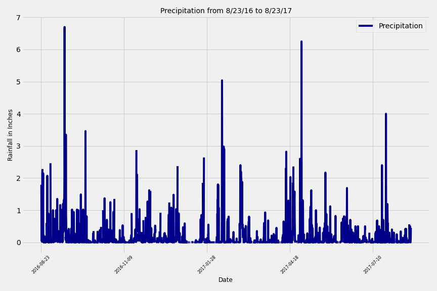
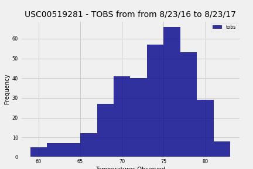

# sqlalchemy-challenge

This homework assignment is focused on analysing climate data in Hawaii in order to properly determine the ideal time to plan a vacation to the island. For the analysis we utilized a combination of python, pandas, matplotlob, and SQLAlchemy ORM queries.

 First we used Python and SQLAlchemy to do some basic climate analysis and data exploration of our climate database.

 Precipitation Analysis
- Designed a query to retrieve the last 12 months of precipitation data.

- Selected only the date and prcp values.

- Loaded the query results into a Pandas DataFrame and set the index to the date column.

- Plotted the results using the DataFrame plot method.

 

 Station Analysis
Designed a query to calculate the total number of stations.

Designed a query to find the most active stations.

Listed the stations and observation counts in descending order.

Designed a query to retrieve the last 12 months of temperature observation data (TOBS).

